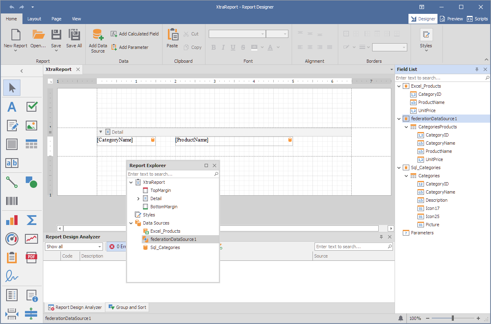

<!-- default badges list -->
# Reporting for WinForms - Bind Report to Federated Data Source

This example demonstrates how to create a federated data source that joins data from multiple data sources into a single query. 

## Files to Review

- [Form1.cs](CS/Form1.cs) (VB: [Form1.vb](VB/Form1.vb))

## Documentation

- [Data Federation](https://docs.devexpress.com/XtraReports/400917/detailed-guide-to-devexpress-reporting/bind-reports-to-data/data-federation)
- [FederationDataSource Class](https://docs.devexpress.com/CoreLibraries/DevExpress.DataAccess.DataFederation.FederationDataSource)

## More Examples

- [Reporting for WinForms - Bind Report to Union-based Federated Data Source](https://github.com/DevExpress-Examples/reporting-winforms-bind-union-federated-data-source)
- [Reporting for WinForms - Create a Federated Data Source at Runtime](https://github.com/DevExpress-Examples/how-to-create-a-federated-data-source-at-runtime)
